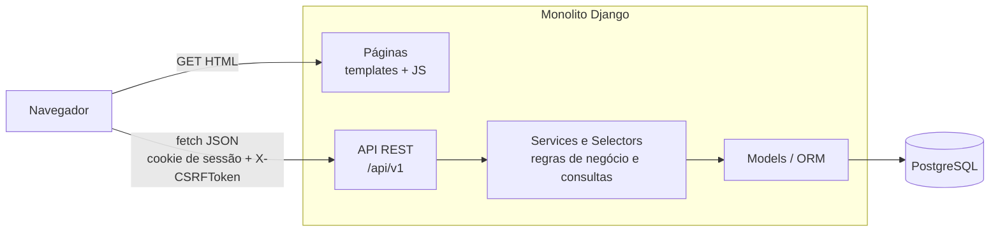
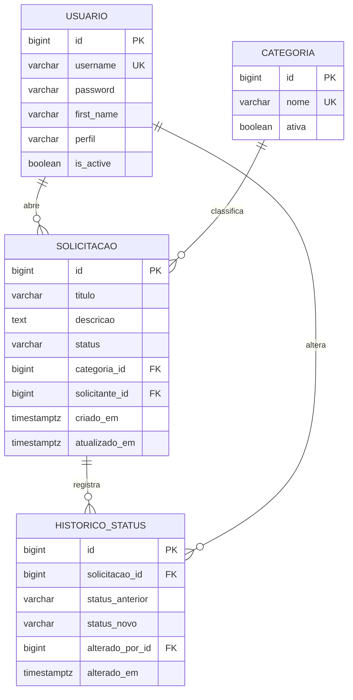
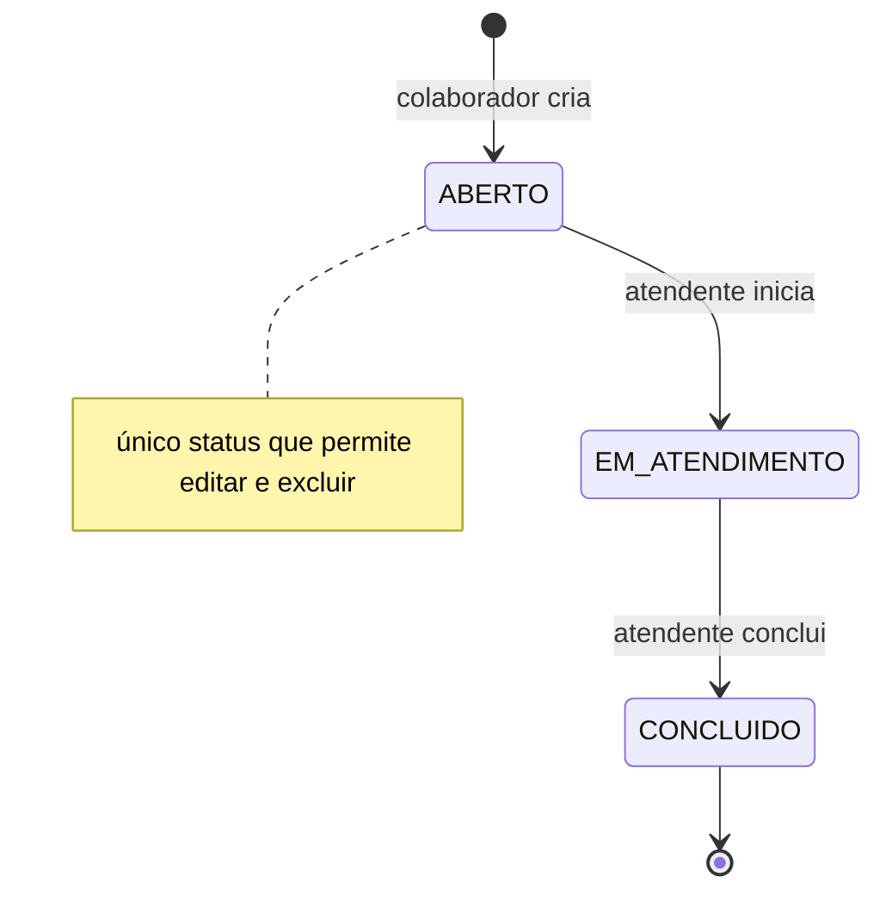

# Portal de Solicitações Internas

Sistema web em que colaboradores registram demandas internas (TI, RH, Compras, Financeiro e Infraestrutura) e acompanham cada uma até a conclusão.

Mini-projeto full stack da 2ª etapa do processo seletivo para **Desenvolvedor(a) de Sistemas Júnior** da **bit Soluções**.

> **Resumo técnico:** monolito modular em **Django 5.2 LTS** com **API REST (Django REST Framework)**. O frontend usa **templates Django + JavaScript** e consome a própria API. Os dados ficam em **PostgreSQL 16**, e a aplicação roda com **Docker Compose**.

---

## Sumário

- [Execução rápida](#execução-rápida)
- [Funcionalidades](#funcionalidades)
- [Stack](#stack)
- [Arquitetura e decisões técnicas](#arquitetura-e-decisões-técnicas)
- [Estrutura de diretórios](#estrutura-de-diretórios)
- [Modelagem de dados](#modelagem-de-dados)
- [Regras de negócio](#regras-de-negócio)
- [API REST](#api-rest)
- [Pré-requisitos](#pré-requisitos)
- [Instalação](#instalação)
- [Configuração](#configuração)
- [Execução](#execução)
- [Acesso](#acesso)
- [Testes automatizados e CI](#testes-automatizados-e-ci)
- [Segurança](#segurança)
- [Evidências](#evidências)
- [Limitações e melhorias futuras](#limitações-e-melhorias-futuras)
- [Documentação complementar](#documentação-complementar)

---

## Execução rápida

```bash
git clone https://github.com/Coutinhopmw/Mini-projeto-bit-Portal-de-Solicita-es.git
cd Mini-projeto-bit-Portal-de-Solicita-es
cp .env.example .env
docker compose up --build
```

Acesse **http://localhost:8000** e entre com `colaborador` / `Colab@2026` ou `atendente` / `Atend@2026`.

O passo a passo completo, incluindo a instalação sem Docker, está em [Instalação](#instalação).

---

## Funcionalidades

| Requisito do enunciado | Como foi atendido |
|---|---|
| **1. Autenticação** | Login com usuário e senha, controle de sessão do Django (cookie HttpOnly + CSRF) e logout. Todas as páginas e endpoints exigem usuário autenticado. |
| **2. Cadastro de solicitações** | Criação com título, descrição e categoria. Data de criação, solicitante e status `Aberto` são preenchidos automaticamente. Edição e exclusão só são permitidas enquanto a solicitação está `Aberto`. |
| **3. Gerenciamento** | Listagem com código, título, categoria, solicitante, data de abertura e status. Tela de detalhes e alteração de status com histórico das mudanças. |
| **4. Consulta e filtros** | Filtros por período (data inicial e final), categoria, status e texto livre no título. Os filtros são combináveis, paginados e ficam na URL, que pode ser compartilhada. |
| **5. Dashboard** | Indicadores de total, abertas, em atendimento e concluídas, respeitando o escopo do perfil do usuário. |
| **Diferenciais** | Docker e Docker Compose, testes automatizados, CI com GitHub Actions e layout responsivo. |

---

## Stack

| Camada | Tecnologia | Por que |
|---|---|---|
| Linguagem | **Python 3.12** | Ecossistema maduro para web e legibilidade, o que ajuda na manutenção por outras pessoas. |
| Framework backend | **Django 5.2 LTS** | Traz ORM, migrations, autenticação, sessões, proteção CSRF e admin prontos. A versão LTS tem suporte de segurança garantido até 2028. |
| API | **Django REST Framework** | Serializers para validação, permissões, paginação e tratamento de exceções padronizados. |
| Filtros | **django-filter** | Filtros declarativos e validados, sem montar queries manualmente nas views. |
| Documentação da API | **drf-spectacular** | Gera o schema OpenAPI 3 e o Swagger UI a partir do próprio código. |
| Banco de dados | **PostgreSQL 16** | Transações, bloqueio de linha, constraints e índices. É o mesmo banco em desenvolvimento, testes e execução. |
| Driver | **psycopg 3** | Driver oficial e atual do PostgreSQL para Python. |
| Configuração | **django-environ** | Lê configurações e segredos de variáveis de ambiente (12-factor), sem segredos no código. |
| Frontend | **Templates Django + JavaScript (ES Modules, `fetch`)** | Interface que consome a API sem framework SPA e sem etapa de build. |
| UI | **Bootstrap 5** (servido localmente) | Responsividade e componentes acessíveis sem custo de design. Funciona sem internet. |
| Servidor | **Gunicorn + WhiteNoise** | Servidor WSGI de produção e entrega de arquivos estáticos sem precisar de Nginx no container. |
| Containers | **Docker + Docker Compose** | Ambiente reproduzível: um comando sobe banco e aplicação. |
| Testes | **pytest + pytest-django + pytest-cov** | Fixtures simples, saída legível e relatório de cobertura. |
| Qualidade | **Ruff** | Lint e formatação com uma ferramenta só. |
| CI | **GitHub Actions** | Lint e testes rodam com PostgreSQL a cada push e pull request. |

A justificativa completa de cada escolha está no [Memorial Técnico](docs/MEMORIAL_TECNICO.md): motivo, benefícios, alternativas comparadas e impacto em manutenção, escalabilidade e produtividade.

---

## Arquitetura e decisões técnicas

### Visão geral



A aplicação é um único projeto Django: um processo, uma origem e um deploy. Ela tem dois pontos de entrada:

- **Páginas**: as views web entregam apenas a estrutura HTML de cada tela. Elas não leem nem gravam dados de negócio.
- **API**: o JavaScript de cada tela busca e envia os dados pela API em `/api/v1/`.

Com isso, toda regra de negócio passa por um único caminho: **API → Services → Models**.

### Decisões arquiteturais

#### 1. Monolito modular em vez de frontend e backend separados

- **Decisão:** um projeto Django dividido em apps por domínio (`accounts`, `solicitacoes`, `core`).
- **Motivo:** o escopo é pequeno e o prazo curto. Um monolito evita dois deploys, configuração de CORS e duplicação da lógica de autenticação. O Django já entrega ORM, migrations, auth, sessões, CSRF e admin.
- **Trade-off:** frontend e backend escalam juntos. Isso é atenuado pela fronteira via API: um SPA ou um app mobile poderia consumir `/api/v1/` sem mudanças no backend.

#### 2. O frontend consome a própria API

- **Decisão:** os templates renderizam a estrutura da página, e os dados são carregados e enviados com `fetch` para a API.
- **Motivo:** atende o requisito de consumo da API e mantém a regra de negócio em um só lugar. Além disso, a API passa a ser exercitada pela própria interface.
- **Trade-off:** exige mais JavaScript que um CRUD renderizado no servidor. Isso é controlado com um cliente HTTP único (`static/js/api.js`) e um módulo por tela, sem framework nem build.

#### 3. Camadas: views → serializers → services/selectors → models

| Camada | Responsabilidade | Não faz |
|---|---|---|
| `api/views.py` | HTTP: recebe a requisição, aplica permissões, devolve o status code | Regra de negócio |
| `api/serializers.py` | Valida a entrada e formata a saída | Acesso a outras entidades ou regras de estado |
| `services.py` | **Escrita**: criar, editar, excluir, alterar status, transações, exceções de domínio | Lidar com HTTP |
| `selectors.py` | **Leitura**: escopo por perfil, filtros, contagens do dashboard | Gravar dados |
| `models.py` | Estrutura, constraints e índices | Orquestrar fluxos |

- **Padrão adotado:** *Service Layer* com separação entre comandos e consultas (services e selectors).
- **Motivo:** views ficam finas e as regras podem ser testadas sem HTTP. As mesmas funções servem à API, ao admin e aos comandos de gerenciamento.

#### 4. Autenticação por sessão em vez de JWT

- **Decisão:** sessão do Django (`SessionAuthentication` no DRF), com login e logout pela API.
- **Motivos:**
  - Frontend e backend estão na mesma origem, então o cookie pode ser `HttpOnly`. O JavaScript não consegue lê-lo, o que reduz o impacto de um eventual XSS. Um JWT guardado em `localStorage` ficaria exposto.
  - A proteção CSRF já vem pronta no Django.
  - O logout é real: a sessão é invalidada no servidor. Com JWT, seria preciso montar uma lista de revogação.
  - Atende diretamente o requisito de "controle de sessão".
- **Trade-off:** a API fica stateful. Se surgir um cliente de outra origem (mobile ou SPA em outro domínio), basta adicionar o `djangorestframework-simplejwt` como segunda classe de autenticação do DRF, sem alterar views nem regras.

#### 5. API REST versionada e erros padronizados

- Prefixo `/api/v1/`, recursos no plural, verbos HTTP e códigos de status semânticos.
- A alteração de status é um **sub-recurso próprio** (`POST /solicitacoes/{id}/status/`). O serializer de edição não aceita o campo `status`, então não é possível pular a máquina de estados com um `PATCH`.
- Um **exception handler** único converte erros de validação, de permissão e de domínio para o mesmo formato JSON (ver [API REST](#api-rest)).

#### 6. Status como máquina de estados; categoria como tabela

- **Status** é um conjunto fechado ligado à regra de negócio. Por isso usa `TextChoices`, um mapa de transições permitidas no service e uma `CheckConstraint` no banco.
- **Categoria** é dado cadastral e pode crescer. Por isso é uma tabela com FK `PROTECT` e a flag `ativa`, que permite desativar uma categoria sem perder o histórico.

#### 7. Perfis de usuário

O enunciado não define quem altera o status. A interpretação adotada foi:

- **Colaborador:** abre e acompanha as **próprias** solicitações.
- **Atendente:** vê **todas** e conduz o atendimento, alterando o status.

A implementação usa um campo `perfil` no usuário customizado e classes de permissão do DRF (`IsAtendente`, `IsSolicitante`). É simples, explícito e aparece no dicionário de dados. Em produção, isso evoluiria para grupos e permissões granulares (ver [Limitações](#limitações-e-melhorias-futuras)).

#### 8. PostgreSQL

- Transações e `select_for_update()` evitam que duas pessoas alterem o status da mesma solicitação ao mesmo tempo.
- `CheckConstraint`, índices e `timestamptz` garantem integridade e datas com fuso horário correto.
- O mesmo banco em desenvolvimento, testes (inclusive na CI) e execução evita diferenças de comportamento que o SQLite introduziria.

#### 9. Nomenclatura

- O **domínio** está em português: `Solicitacao`, `Categoria`, `HistoricoStatus`, `criado_em`, `solicitante`.
- **Termos técnicos do framework** ficam em inglês: `views`, `serializers`, `services`, `selectors`.
- As tabelas têm `db_table` explícito (`usuario`, `categoria`, `solicitacao`, `historico_status`), o que facilita consultas SQL diretas e a leitura do dicionário de dados.

### Fluxo de uma requisição (exemplo: alterar status)

1. Na tela de detalhes, o JavaScript envia `POST /api/v1/solicitacoes/42/status/` com `{"status": "EM_ATENDIMENTO"}`. A requisição leva o cookie de sessão e o header `X-CSRFToken`.
2. O DRF autentica a sessão, valida o CSRF e verifica a permissão `IsAtendente`.
3. A view valida o payload com `AlterarStatusSerializer` e chama `services.alterar_status(...)`.
4. O service abre uma transação, bloqueia a linha com `select_for_update()`, valida a transição, salva e registra o `HistoricoStatus`.
5. O resultado volta para a tela:
   - Se a transição for inválida, o service lança `TransicaoInvalida` e o exception handler devolve **409** no formato padrão.
   - Se der certo, a API devolve **200** com a solicitação atualizada.
6. O JavaScript atualiza o badge de status e a linha do tempo e mostra uma confirmação ao usuário.

---

## Estrutura de diretórios

```
.
├── apps/
│   ├── core/                      # Código compartilhado entre apps
│   │   ├── exceptions.py          # Exceções de domínio + handler padronizado da API
│   │   ├── permissions.py         # IsAtendente, IsSolicitante
│   │   └── pagination.py          # Paginação padrão da API
│   ├── accounts/                  # Usuários e autenticação
│   │   ├── models.py              # Usuario (AbstractUser + perfil)
│   │   ├── api/                   # login, logout, me
│   │   ├── views.py               # Página de login
│   │   └── tests/
│   └── solicitacoes/              # Domínio principal
│       ├── models.py              # Categoria, Solicitacao, HistoricoStatus
│       ├── services.py            # Escrita: regras de negócio
│       ├── selectors.py           # Leitura: escopo por perfil, dashboard
│       ├── api/
│       │   ├── serializers.py
│       │   ├── filters.py         # FilterSet de período, categoria, status e texto
│       │   ├── views.py
│       │   └── urls.py
│       ├── views.py               # Páginas (TemplateView + LoginRequiredMixin)
│       ├── urls.py
│       ├── migrations/            # Inclui data migration das categorias
│       ├── management/commands/
│       │   └── seed_demo.py       # Usuários e solicitações de demonstração
│       └── tests/
├── config/                        # Projeto Django
│   ├── settings.py                # Lido de variáveis de ambiente
│   ├── urls.py                    # Rotas de páginas, /api/v1/, /api/docs/, /admin/
│   └── wsgi.py
├── templates/
│   ├── base.html                  # Layout, navbar, meta tag CSRF, área de mensagens
│   ├── accounts/login.html
│   └── solicitacoes/              # dashboard, lista, formulario, detalhe
├── static/
│   ├── css/app.css
│   ├── js/
│   │   ├── api.js                 # Cliente HTTP único (CSRF, JSON, tratamento de erros)
│   │   ├── ui.js                  # Toasts, badges de status, formatação de datas
│   │   └── pages/                 # Um módulo por tela
│   └── vendor/bootstrap/          # Bootstrap servido localmente
├── sql/
│   └── schema.sql                 # DDL completo gerado a partir das migrations
├── docs/
│   ├── MEMORIAL_TECNICO.md
│   ├── DICIONARIO_DE_DADOS.md
│   └── evidencias/                # Prints da aplicação
├── docker/
│   └── entrypoint.sh              # migrate → seed (opcional) → collectstatic → gunicorn
├── .github/workflows/ci.yml       # Lint + testes com PostgreSQL
├── Dockerfile
├── docker-compose.yml
├── .env.example
├── requirements.txt               # Dependências de execução
├── requirements-dev.txt           # Execução + testes e lint
├── pyproject.toml                 # Configuração do Ruff e do pytest
└── manage.py
```

**Princípios de organização:**

- Apps organizados por **domínio**, não por tipo de arquivo.
- Todos os apps seguem o **mesmo layout interno** (`api/`, `services`, `selectors`, `tests/`), então quem conhece um app encontra as coisas em qualquer outro.
- Código usado por mais de um app fica em `core`.

---

## Modelagem de dados



| Tabela | Finalidade | Restrições principais |
|---|---|---|
| `usuario` | Usuário do sistema (estende `AbstractUser`) | `username` único; `perfil` ∈ {`COLABORADOR`, `ATENDENTE`} |
| `categoria` | Categorias de solicitação | `nome` único; populada por data migration com TI, RH, Compras, Financeiro e Infraestrutura |
| `solicitacao` | Demanda registrada | `status` com `CheckConstraint`; FKs com `PROTECT`; índices em `status`, `criado_em` e `categoria_id` |
| `historico_status` | Linha do tempo de cada solicitação | Gravado na mesma transação da mudança de status; FK `CASCADE` para a solicitação |

- O **código** exibido na listagem (ex.: `SOL-000042`) é derivado do `id`, não armazenado. Assim não há risco de divergência nem de duplicidade.
- Usuários com solicitações **não são excluídos**, apenas desativados (`is_active = false`). A FK `PROTECT` impede a exclusão e preserva o histórico.

### Ciclo de vida da solicitação



O dicionário de dados completo está em [docs/DICIONARIO_DE_DADOS.md](docs/DICIONARIO_DE_DADOS.md), com campo, tipo, nulidade, padrão, restrições e descrição.

---

## Regras de negócio

| Código | Regra | Onde é aplicada | Resposta quando violada |
|---|---|---|---|
| RN01 | Apenas usuários autenticados acessam páginas e API | `LoginRequiredMixin` e `IsAuthenticated` | Páginas redirecionam para `/login/`; a API devolve **401** |
| RN02 | A solicitação nasce com status `Aberto`, solicitante = usuário logado e data = momento da criação | `services.criar_solicitacao` | Esses campos são ignorados se enviados pelo cliente |
| RN03 | Só é possível editar ou excluir uma solicitação com status `Aberto` | `services.editar_solicitacao` e `services.excluir_solicitacao` | **409** `SOLICITACAO_NAO_EDITAVEL` |
| RN04 | Só o solicitante pode editar ou excluir a própria solicitação | Permissão `IsSolicitante` | **403** |
| RN05 | O colaborador vê apenas as próprias solicitações; o atendente vê todas | `selectors.solicitacoes_visiveis` | **404**, sem revelar que a solicitação existe |
| RN06 | Apenas atendentes alteram o status | Permissão `IsAtendente` | **403** |
| RN07 | Transições permitidas: `Aberto → Em Atendimento → Concluído`. `Concluído` é final | `services.alterar_status` | **409** `TRANSICAO_INVALIDA` |
| RN08 | Toda mudança de status gera um registro de histórico na mesma transação | `services.alterar_status` | — |
| RN09 | A categoria escolhida precisa estar ativa | Serializer | **400** |
| RN10 | No filtro de período, a data inicial não pode ser posterior à final | `SolicitacaoFilter` | **400** |

---

## API REST

- **Base:** `/api/v1/`
- **Documentação interativa (Swagger UI):** `/api/docs/`
- **Schema OpenAPI 3:** `/api/schema/`
- **Autenticação:** sessão (cookie) + header `X-CSRFToken` nas requisições que alteram dados.

### Endpoints

| Método | Rota | Perfil | Descrição |
|---|---|---|---|
| `POST` | `/api/v1/auth/login/` | Público | Autentica e abre a sessão |
| `POST` | `/api/v1/auth/logout/` | Autenticado | Encerra a sessão |
| `GET` | `/api/v1/auth/me/` | Autenticado | Dados e perfil do usuário logado |
| `GET` | `/api/v1/categorias/` | Autenticado | Categorias ativas |
| `GET` | `/api/v1/solicitacoes/` | Autenticado | Listagem com filtros e paginação |
| `POST` | `/api/v1/solicitacoes/` | Autenticado | Cria uma solicitação |
| `GET` | `/api/v1/solicitacoes/{id}/` | Autenticado | Detalhes |
| `PATCH` | `/api/v1/solicitacoes/{id}/` | Solicitante | Edita título, descrição e categoria (somente `Aberto`) |
| `DELETE` | `/api/v1/solicitacoes/{id}/` | Solicitante | Exclui (somente `Aberto`) |
| `POST` | `/api/v1/solicitacoes/{id}/status/` | Atendente | Altera o status |
| `GET` | `/api/v1/solicitacoes/{id}/historico/` | Autenticado | Histórico de mudanças de status |
| `GET` | `/api/v1/dashboard/` | Autenticado | Total, abertas, em atendimento e concluídas |

### Filtros da listagem

| Parâmetro | Exemplo | Efeito |
|---|---|---|
| `data_inicio` | `2026-10-01` | Criadas a partir desta data (inclusive) |
| `data_fim` | `2026-10-05` | Criadas até esta data (inclusive) |
| `categoria` | `1` | ID da categoria |
| `status` | `ABERTO` | `ABERTO`, `EM_ATENDIMENTO` ou `CONCLUIDO` |
| `q` | `impressora` | Busca no título, sem diferenciar maiúsculas e minúsculas |
| `page` | `2` | Página (10 itens por página) |

**Exemplo:**

```http
GET /api/v1/solicitacoes/?status=ABERTO&categoria=1&data_inicio=2026-10-01&q=impressora
```

```json
{
  "count": 1,
  "next": null,
  "previous": null,
  "results": [
    {
      "id": 42,
      "codigo": "SOL-000042",
      "titulo": "Impressora do 2º andar sem toner",
      "categoria": { "id": 1, "nome": "TI" },
      "solicitante": { "id": 3, "username": "colaborador", "nome": "Carla Colaboradora" },
      "status": "ABERTO",
      "status_display": "Aberto",
      "criado_em": "2026-10-05T14:32:10-03:00"
    }
  ]
}
```

### Formato padrão de erro

Todos os erros da API seguem o mesmo formato:

```json
{
  "erro": {
    "codigo": "TRANSICAO_INVALIDA",
    "mensagem": "Não é possível alterar o status de Concluído para Aberto.",
    "detalhes": {}
  }
}
```

Nos erros de validação, `detalhes` lista os problemas por campo:

```json
{
  "erro": {
    "codigo": "VALIDACAO",
    "mensagem": "Dados inválidos.",
    "detalhes": { "titulo": ["Informe um título com pelo menos 3 caracteres."] }
  }
}
```

| Status | Quando |
|---|---|
| `200` / `201` / `204` | Sucesso (leitura e edição / criação / exclusão) |
| `400` | Dados inválidos |
| `401` | Não autenticado |
| `403` | Autenticado, mas sem permissão para a ação |
| `404` | Recurso inexistente ou fora do escopo do usuário |
| `409` | Ação que conflita com o estado atual da solicitação |
| `429` | Excesso de tentativas de login |

---

## Pré-requisitos

### Linguagem

- **Python 3.12**

### Banco de dados

- **PostgreSQL 16**

### Dependências

**Execução com Docker (recomendada):**

- Git
- Docker 24+ com Docker Compose v2

**Execução manual:**

- Git
- Python 3.12 com `pip` e `venv`
- PostgreSQL 16 em execução local

**Bibliotecas Python** (instaladas automaticamente):

| Arquivo | Pacotes |
|---|---|
| `requirements.txt` | `Django`, `djangorestframework`, `django-filter`, `drf-spectacular`, `psycopg[binary]`, `django-environ`, `whitenoise`, `gunicorn` |
| `requirements-dev.txt` | Tudo acima + `pytest`, `pytest-django`, `pytest-cov`, `ruff` |

O frontend **não exige Node.js nem npm**. O Bootstrap e os scripts ficam em `static/`.

---

## Instalação

### Opção A: Docker (recomendada)

```bash
git clone https://github.com/Coutinhopmw/Mini-projeto-bit-Portal-de-Solicita-es.git
cd Mini-projeto-bit-Portal-de-Solicita-es
cp .env.example .env
docker compose up --build
```

O que acontece ao subir:

1. O serviço `db` (PostgreSQL 16) inicia com healthcheck.
2. O serviço `web` espera o banco ficar saudável e executa o `docker/entrypoint.sh`, que:
   1. aplica as migrations (tabelas, constraints, índices e categorias);
   2. roda o `seed_demo`, se `SEED_DEMO=True`;
   3. executa o `collectstatic`;
   4. inicia o Gunicorn na porta `8000`.

O mesmo comando instala banco, backend e frontend; não há passos adicionais.

### Opção B: Manual

#### Banco de dados

Crie o usuário e o banco no PostgreSQL:

```sql
CREATE USER portal WITH PASSWORD 'portal';
CREATE DATABASE portal OWNER portal;
ALTER USER portal CREATEDB;  -- necessário para o pytest criar o banco de testes
```

#### Backend

```bash
git clone https://github.com/Coutinhopmw/Mini-projeto-bit-Portal-de-Solicita-es.git
cd Mini-projeto-bit-Portal-de-Solicita-es

python3.12 -m venv .venv
source .venv/bin/activate          # Windows: .venv\Scripts\activate

pip install -r requirements-dev.txt

cp .env.example .env               # Windows: copy .env.example .env
# No .env, ajuste POSTGRES_HOST=localhost

python manage.py migrate
python manage.py seed_demo
```

#### Frontend

Não há instalação separada. O frontend faz parte do monolito:

- os templates ficam em `templates/`;
- CSS, JavaScript e Bootstrap ficam em `static/`;
- em desenvolvimento, o `runserver` serve os estáticos;
- no container, quem serve é o WhiteNoise.

Para simular o ambiente de execução fora do Docker:

```bash
python manage.py collectstatic --noinput
```

### Estrutura do banco: migrations e script SQL

| Mecanismo | Uso |
|---|---|
| **Migrations do Django** (`python manage.py migrate`) | Mecanismo oficial. Cria todas as tabelas, constraints e índices e insere as categorias. É idempotente: pode ser executado várias vezes sem efeito colateral. |
| **`sql/schema.sql`** | DDL completo extraído do banco já migrado. Serve para revisão e para provisionar a estrutura sem Python. |
| **[`docs/DICIONARIO_DE_DADOS.md`](docs/DICIONARIO_DE_DADOS.md)** | Descrição de cada tabela e campo. |

Para regenerar o `schema.sql` depois de alterar os models:

```bash
docker compose exec db pg_dump -U portal --schema-only --no-owner portal > sql/schema.sql
```

---

## Configuração

### Variáveis de ambiente

As variáveis ficam no arquivo `.env`, criado a partir do `.env.example`. O `.env` está no `.gitignore`.

| Variável | Exemplo | Descrição |
|---|---|---|
| `DJANGO_SECRET_KEY` | `troque-esta-chave` | Chave criptográfica do Django. **Obrigatória**; use um valor longo e aleatório fora do ambiente local. |
| `DJANGO_DEBUG` | `True` | Modo de depuração. O padrão no código é `False`; o `.env.example` usa `True` para desenvolvimento local. |
| `DJANGO_ALLOWED_HOSTS` | `localhost,127.0.0.1` | Hosts aceitos, separados por vírgula. |
| `DJANGO_CSRF_TRUSTED_ORIGINS` | `http://localhost:8000` | Origens confiáveis para CSRF. |
| `DJANGO_SECURE_COOKIES` | `False` | Com `True`, ativa a flag `Secure` nos cookies de sessão e CSRF. Use apenas com HTTPS. |
| `POSTGRES_DB` | `portal` | Nome do banco. |
| `POSTGRES_USER` | `portal` | Usuário do banco. |
| `POSTGRES_PASSWORD` | `portal` | Senha do banco. |
| `POSTGRES_HOST` | `db` | `db` no Docker; `localhost` na instalação manual. |
| `POSTGRES_PORT` | `5432` | Porta do banco. |
| `SEED_DEMO` | `True` | Com `True`, o container roda o `seed_demo` ao iniciar. |

No Docker, o PostgreSQL também fica acessível pela máquina host na porta **5433**, para inspeção com `psql` ou DBeaver sem conflitar com uma instalação local.

### Credenciais de demonstração

Os usuários abaixo são criados pelo comando `seed_demo`, junto com cerca de 15 solicitações em categorias e status variados. O comando é idempotente: rodá-lo de novo não duplica dados.

| Usuário | Senha | Perfil | Use para testar |
|---|---|---|---|
| `colaborador` | `Colab@2026` | Colaborador | Criar, editar e excluir as próprias solicitações |
| `colaborador2` | `Colab@2026` | Colaborador | Isolamento: não enxerga as solicitações do `colaborador` |
| `atendente` | `Atend@2026` | Atendente | Ver todas as solicitações e alterar o status |
| `admin` | `Admin@2026` | Atendente + superusuário | Django Admin em `/admin/` |

> Essas credenciais existem apenas para demonstração e não devem ser usadas em produção.

---

## Execução

### Backend

**Docker:**

```bash
docker compose up            # sobe a aplicação (use --build após mudar dependências)
docker compose logs -f web   # acompanha os logs
docker compose down          # para os containers
docker compose down -v       # para e apaga o banco (recomeça do zero)
```

**Manual:**

```bash
source .venv/bin/activate
python manage.py runserver
```

### Frontend

O frontend é servido pelo mesmo processo do backend; não há comando separado. Com o backend no ar, acesse **http://localhost:8000**.

### Comandos úteis

| Ação | Manual | Docker |
|---|---|---|
| Aplicar migrations | `python manage.py migrate` | `docker compose exec web python manage.py migrate` |
| Popular dados de demonstração | `python manage.py seed_demo` | `docker compose exec web python manage.py seed_demo` |
| Criar superusuário | `python manage.py createsuperuser` | `docker compose exec web python manage.py createsuperuser` |
| Rodar testes | `pytest` | `docker compose exec web pytest` |
| Testes com cobertura | `pytest --cov=apps` | `docker compose exec web pytest --cov=apps` |
| Lint | `ruff check .` | `docker compose exec web ruff check .` |
| Formatação | `ruff format .` | `docker compose exec web ruff format .` |

---

## Acesso

| URL | Conteúdo |
|---|---|
| http://localhost:8000/ | Dashboard (redireciona para o login se não houver sessão) |
| http://localhost:8000/login/ | Login |
| http://localhost:8000/solicitacoes/ | Listagem com filtros |
| http://localhost:8000/solicitacoes/nova/ | Nova solicitação |
| http://localhost:8000/api/docs/ | Swagger UI da API |
| http://localhost:8000/admin/ | Django Admin |

Os usuários de teste estão em [Credenciais de demonstração](#credenciais-de-demonstração).

### Roteiro sugerido para avaliação

1. Entre como **`colaborador`**:
   1. Crie uma solicitação e confira que ela aparece como **Aberto**, com data e solicitante automáticos.
   2. Edite essa solicitação e depois exclua outra que também esteja aberta.
   3. Use os filtros de período, categoria, status e texto e confira os números do dashboard.
2. Entre como **`colaborador2`** e confirme que as solicitações do `colaborador` não aparecem.
3. Entre como **`atendente`**:
   1. Abra a solicitação criada no passo 1 e mude o status para **Em Atendimento** e depois para **Concluído**.
   2. Confira o histórico na tela de detalhes.
4. Volte como **`colaborador`** e confirme que a solicitação concluída não pode mais ser editada nem excluída.
5. Em `/api/docs/`, teste os mesmos fluxos diretamente pela API.

---

## Testes automatizados e CI

Os testes usam **pytest + pytest-django** contra um **PostgreSQL real**, o mesmo banco da execução. Eles cobrem:

- **Services:** criação com campos automáticos, bloqueio de edição e exclusão fora de `Aberto`, transições válidas e inválidas e gravação do histórico.
- **Permissões:** 401 sem login, 403 para colaborador alterando status, 404 ao acessar solicitação de outro usuário.
- **API:** contrato dos endpoints, formato padrão de erro, cada filtro isolado e combinado, validação do período.
- **Dashboard:** contagens corretas para cada perfil.

**CI:** o workflow `.github/workflows/ci.yml` roda a cada push e pull request:

1. `ruff check` e `ruff format --check`;
2. `pytest` com um serviço PostgreSQL 16.

---

## Segurança

- **Senhas:** hash PBKDF2 (padrão do Django) e validadores de senha ativos.
- **Sessão:** cookie `HttpOnly` com `SameSite=Lax`, e flag `Secure` via `DJANGO_SECURE_COOKIES` em ambientes com HTTPS.
- **CSRF:** obrigatório em toda requisição que altera dados. O token é lido de uma meta tag do template e enviado no header `X-CSRFToken`.
- **Autorização por objeto:** a consulta já é filtrada pelo perfil do usuário. Recursos fora do escopo retornam 404, sem revelar que existem.
- **Força bruta:** limite de tentativas no endpoint de login (`ScopedRateThrottle`).
- **XSS:** os templates escapam a saída automaticamente, e o JavaScript insere dados do usuário com `textContent`, nunca com `innerHTML`.
- **SQL injection:** todas as consultas passam pelo ORM, que parametriza os valores.
- **Configuração:** segredos ficam em variáveis de ambiente, e o `DEBUG` é `False` por padrão no código.

---

## Evidências

Os prints da aplicação funcionando estão em [`docs/evidencias/`](docs/evidencias/):

| Arquivo | Tela |
|---|---|
| `01-login.png` | Login |
| `02-dashboard.png` | Dashboard com indicadores |
| `03-listagem-filtros.png` | Listagem com filtros aplicados |
| `04-nova-solicitacao.png` | Formulário de criação |
| `05-detalhe-historico.png` | Detalhes com histórico de status |
| `06-alterar-status.png` | Atendente alterando o status |
| `07-edicao-bloqueada.png` | Tentativa de editar uma solicitação concluída |
| `08-swagger.png` | Documentação da API |
| `09-mobile.png` | Layout responsivo |
| `10-testes.png` | Execução dos testes |

---

## Limitações e melhorias futuras

Resumo abaixo; a análise crítica completa está no [Memorial Técnico](docs/MEMORIAL_TECNICO.md).

- **Escopo funcional:**
  - Não há notificações (e-mail ou chat) quando o status muda.
  - Não há anexos, comentários, prioridade, SLA nem atribuição a um atendente específico.
- **Busca:** usa `icontains` no título. Com grande volume, o próximo passo seria `pg_trgm` ou busca full-text do PostgreSQL.
- **Perfis:** são fixos em um campo do usuário. Em ambiente corporativo, o caminho seria grupos e permissões granulares, ou integração com SSO (LDAP ou Azure AD).
- **Limite de login:** o throttle usa cache local por processo. Em produção, o cache seria compartilhado (Redis).
- **Observabilidade:** faltam logs estruturados, métricas e rastreamento de erros (ex.: Sentry).
- **Frontend:** sem framework. Se a interface crescer, pode-se adotar HTMX ou um SPA consumindo a mesma API, sem mudanças no backend.

---

## Documentação complementar

- [Memorial Técnico de Desenvolvimento](docs/MEMORIAL_TECNICO.md): tecnologias, justificativas técnicas e conceituais, análise crítica.
- [Dicionário de Dados](docs/DICIONARIO_DE_DADOS.md): tabelas, campos, tipos e restrições.
- [Script de criação do banco](sql/schema.sql): DDL completo.
- Documentação interativa da API: `/api/docs/`, com a aplicação em execução.

---

## Autor

**Cássio Coutinho Lima**
GitHub: [@Coutinhopmw](https://github.com/Coutinhopmw)
